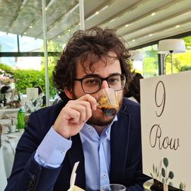

I am Fede, a Senior ML Scientist at [TogetherAI](https://www.together.ai/){:target="_blank"} (formerly at OpenEvidence and Stanford). I am working on post-training in LLMs, mainly self-improving and self-evolving AI Agents.

  

I am interested in self-evolving agents and their application in science. I co-invented **[TextGrad](https://www.nature.com/articles/s41586-025-08661-4){:target="_blank"}** (Nature 2025), a library for autograd with textual feedback, and **[TTT-Discover](https://github.com/test-time-training/discover){:target="_blank"}**, achieving **new scientific discoveries** on open problems through test-time training. I also co-organized **[Agents4Science](https://agents4science.stanford.edu/){:target="_blank"}**, the first AI-first scientific conference (featured in [Science](https://www.science.org/content/article/futuristic-meeting-ais-took-lead-producing-and-reviewing-all-studies){:target="_blank"}, [Nature](https://www.nature.com/articles/d41586-025-03363-3){:target="_blank"}, [MIT Technology Review](https://www.technologyreview.com/2025/08/22/1122304/ai-scientist-research-autonomous-agents/){:target="_blank"}, and [Science News](https://www.sciencenews.org/article/science-conference-test-ai-agents){:target="_blank"}).

My [safety](https://aclanthology.org/2024.naacl-long.301/){:target="_blank"} research has been adopted by [Meta](https://huggingface.co/meta-llama/Meta-Llama-Guard-2-8B){:target="_blank"}, [OpenAI](https://cdn.openai.com/o1-system-card-20241205.pdf) and [Anthropic](https://www-cdn.anthropic.com/de8ba9b01c9ab7cbabf5c33b80b7bbc618857627/Model_Card_Claude_3.pdf){:target="_blank"}, while [FashionCLIP](https://huggingface.co/patrickjohncyh/fashion-clip){:target="_blank"} serves as a backend for numerous fashion recommendation systems, accumulating 100 million downloads.

My work has been published in top venues such as [Nature](https://www.nature.com/articles/s41586-025-08661-4){:target="_blank"}, [Nature Machine Intelligence](https://www.nature.com/articles/s42256-025-01113-8){:target="_blank"}, [ICML](https://openreview.net/forum?id=CmOmaxkt8p){:target="_blank"}, [ICLR](https://openreview.net/forum?id=gT5hALch9z){:target="_blank"}, and [NAACL](https://aclanthology.org/2024.naacl-long.301/){:target="_blank"}. [Full publication list on Google Scholar](https://scholar.google.com/citations?user=1okGjb8AAAAJ&hl=it){:target="_blank"}.
